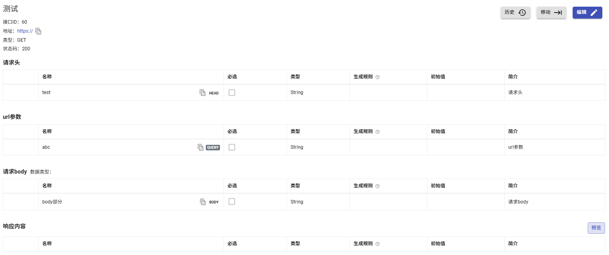

rap2-dolores的一个可以打包的版本，基于官方rap2-dolores-2.2.3-relase，并且修改了请求参数的编辑界面，让请求头，url参数和请求body的区分更明显

# 0. 部署说明
请看[官方文档](https://github.com/thx/rap2-dolores)

# 1. 界面修改
修改了InterfaceEditor.tsx, InterfaceSummary.tsx, PropertyList.tsx这3个文件

## 1.1 效果：

## 1.2 已知问题
修改了请求body的数据类型，点击保存后没有立刻生效，实际上已经保存数据库，要刷新或者点一下编辑才能看到生效
